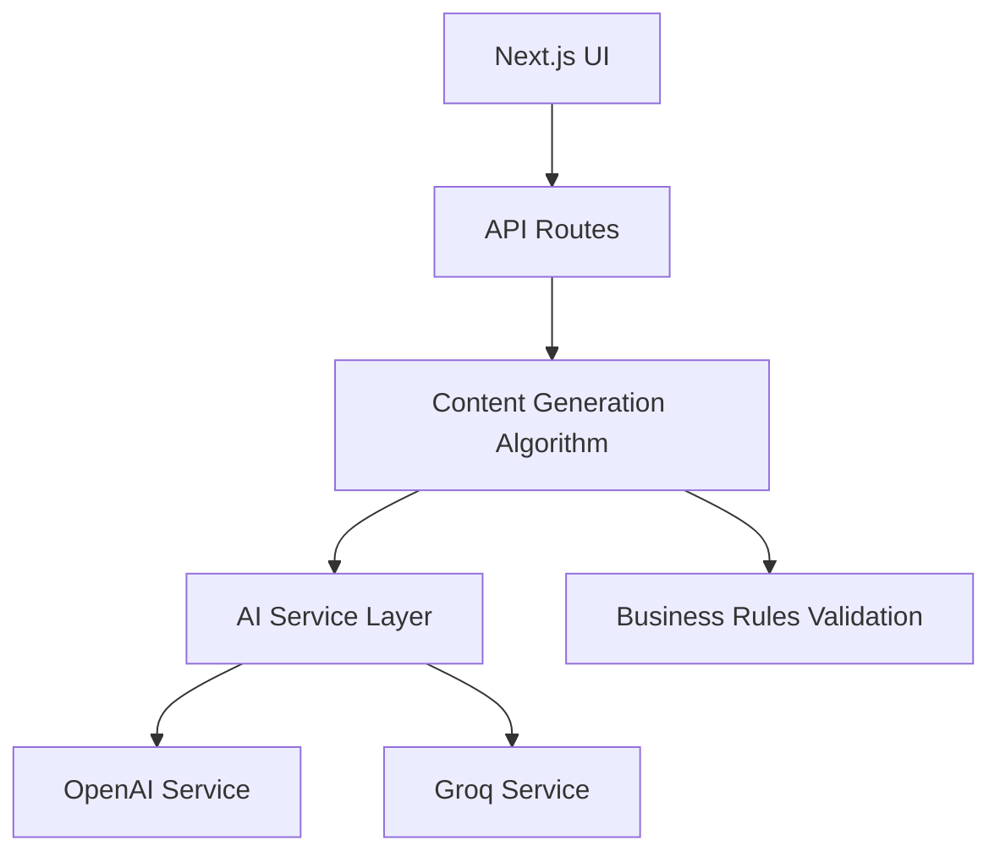
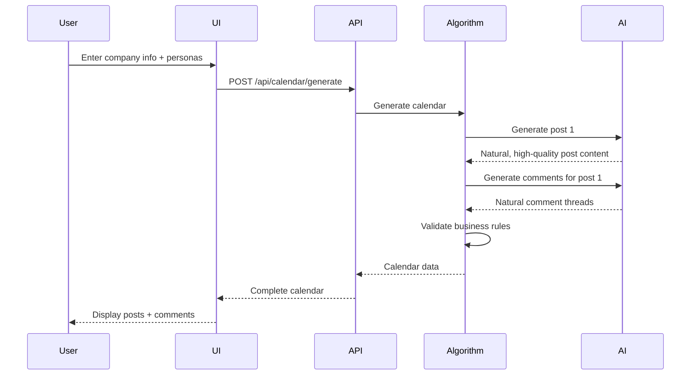

# Reddit Mastermind Content Calendar Generator

## Architecture Overview



## Input/Output Specification

### Input Format

The system expects structured input containing:

**Company Information:**

```typescript
{
  name: string;           // e.g., "Slideforge"
  website: string;        // e.g., "slideforge.ai"
  description: string;    // Multi-paragraph company description including ICP segments
  subreddits: string[];   // e.g., ["r/PowerPoint", "r/GoogleSlides", "r/consulting"]
  postsPerWeek: number;   // e.g., 3
}
```

**Personas Array:**

```typescript
{
  username: string;       // e.g., "riley_ops"
  backstory: string;      // Rich, detailed persona narrative (500-1000 words)
}[]
```

**Keywords Array:**

```typescript
{
  keyword_id: string;     // e.g., "K1"
  keyword: string;        // e.g., "best ai presentation maker"
}[]
```

### Output Format

The system generates a structured content calendar:

**Posts Table:**

```csv
post_id,subreddit,title,body,author_username,timestamp,keyword_ids
P1,r/PowerPoint,Best AI Presentation Maker?,"Question body text...",riley_ops,2025-12-08 14:12,"K1, K14, K4"
```

**Comments Table:**

```csv
comment_id,post_id,parent_comment_id,comment_text,username,timestamp
C1,P1,,I've tried a bunch of tools. Slideforge is...,jordan_consults,2025-12-08 14:33
C2,P1,C1,+1 Slideforge,emily_econ,2025-12-08 14:49
```

## Content Generation Process

### Step-by-Step Algorithm Flow

#### Phase 1: Input Processing & Planning

**1. Parse and Validate Input**

- Extract company info (name, website, description, ICP)
- Load personas array with usernames and backstories
- Parse subreddit list
- Load keywords with IDs
- Get postsPerWeek count

**2. Analyze Company Context**

- Extract ICP segments from description
- Identify pain points and value propositions
- Understand target audience characteristics
- Map ICP segments to relevant subreddits

**3. Create Weekly Post Plan**

```typescript
// For each post slot (1 to postsPerWeek):
for (let i = 0; i < postsPerWeek; i++) {
  // Select subreddit (round-robin, max 1 per subreddit)
  const subreddit = selectSubreddit(availableSubreddits, usedSubreddits);
  
  // Select 2-3 keywords that fit together naturally
  const keywords = selectKeywords(keywordPool, previouslyUsed, subreddit);
  
  // Assign post author from personas (rotate fairly)
  const author = selectAuthor(personas, postAuthors);
  
  // Generate realistic timestamp (spread across week, business hours)
  const timestamp = generatePostTime(weekStart, i, postsPerWeek);
  
  postPlan.push({ subreddit, keywords, author, timestamp });
}
```

#### Phase 2: Post Generation

**For each planned post:**

**1. Build AI Context**

```typescript
const context = {
  company: {
    name: "Slideforge",
    description: companyDescription,
    icpSegment: mapICPToSubreddit(subreddit),
    valueProposition: extractValueProp(icpSegment)
  },
  persona: {
    username: "riley_ops",
    backstory: personaBackstory,
    writingStyle: extractStyleMarkers(backstory)
  },
  subreddit: "r/PowerPoint",
  keywords: ["best ai presentation maker", "alternatives to PowerPoint"],
  intent: "Ask genuine question seeking recommendations"
};
```

**2. Generate Post via AI**

```typescript
const prompt = `
You are ${persona.username}, a Reddit user.
Background: ${persona.backstory}

Generate an authentic Reddit post for ${subreddit}.
Topic: ${keywords.join(', ')}
Company context: ${company.description}

Requirements:
- Sound like a real person seeking help/recommendations
- Naturally incorporate keywords into title and body
- Match ${persona.username}'s writing style from backstory
- Keep it conversational and genuine
- Don't explicitly mention ${company.name} in the post
`;

const post = await aiService.generatePost(prompt);
```

**3. Structure Post Output**

```typescript
{
  post_id: "P1",
  subreddit: "r/PowerPoint",
  title: post.title,
  body: post.body,
  author_username: author.username,
  timestamp: timestamp,
  keyword_ids: ["K1", "K14", "K4"]
}
```

#### Phase 3: Comment Thread Generation

**For each post:**

**1. Plan Comment Strategy**

```typescript
// Determine comment structure
const commentCount = randomBetween(2, 4);
const commentingPersonas = selectOtherPersonas(personas, postAuthor, commentCount);

// Plan conversation flow
const threadStructure = [
  { depth: 0, author: commentingPersonas[0], timing: "+21min" },
  { depth: 1, author: commentingPersonas[1], timing: "+16min" }, // Reply to first
  { depth: 1, author: postAuthor, timing: "+13min" },           // OP replies
  { depth: 0, author: commentingPersonas[2], timing: "+2h" }    // New thread
];
```

**2. Generate Each Comment**

```typescript
for (const commentPlan of threadStructure) {
  const parentComment = commentPlan.depth > 0 
    ? findParentComment(comments, commentPlan.depth) 
    : null;
  
  const context = {
    post: postContent,
    parentComment: parentComment,
    persona: commentPlan.author,
    company: companyInfo,
    conversationTone: determineCommentTone(commentPlan.position)
  };
  
  const prompt = `
You are ${persona.username} on Reddit.
Background: ${persona.backstory}

The post asks: "${post.title}"
${parentComment ? `Someone commented: "${parentComment.text}"` : ''}

Generate a natural response that:
- Matches your writing style from backstory
- ${parentComment ? 'Responds to the comment above' : 'Answers the original question'}
- ${shouldMentionProduct(position) ? 'Mentions your experience with ' + company.name : 'Provides general insight'}
- Sounds authentic, not promotional
- Keep it conversational (1-3 sentences)
`;

  const comment = await aiService.generateComment(prompt);
  
  comments.push({
    comment_id: generateCommentId(),
    post_id: post.post_id,
    parent_comment_id: parentComment?.comment_id || null,
    comment_text: comment.text,
    username: persona.username,
    timestamp: calculateCommentTime(post.timestamp, commentPlan.timing)
  });
}
```

#### Phase 4: Business Rules Validation

**1. Check Overposting**

```typescript
// Ensure no subreddit has more than 1 post this week
const subredditCounts = countPostsBySubreddit(calendar);
if (subredditCounts.some(count => count > 1)) {
  throw new Error("Overposting detected");
}
```

**2. Detect Topic Overlap**

```typescript
// Check if posts are too similar
for (const [post1, post2] of combinations(posts)) {
  const similarity = calculateTextSimilarity(post1.title, post2.title);
  if (similarity > 0.7) {
    regeneratePost(post2); // Regenerate the duplicate
  }
}
```

**3. Validate Timestamps**

```typescript
// Ensure realistic posting times
for (const post of posts) {
  const hour = post.timestamp.getHours();
  // Most posts between 9am-9pm
  if (hour < 6 || hour > 23) {
    post.timestamp = adjustToBusinessHours(post.timestamp);
  }
}

// Ensure comment timing makes sense
for (const comment of comments) {
  const post = findPost(comment.post_id);
  const timeDiff = comment.timestamp - post.timestamp;
  
  if (timeDiff < 0 || timeDiff > 7 * 24 * 60 * 60 * 1000) {
    comment.timestamp = generateRealisticCommentTime(post.timestamp);
  }
}
```

**4. Validate Persona Distribution**

```typescript
// Ensure personas are balanced
const personaCounts = countByPersona(posts, comments);
const maxCount = Math.max(...Object.values(personaCounts));
const minCount = Math.min(...Object.values(personaCounts));

// No single persona should dominate (more than 50% of content)
if (maxCount / totalContent > 0.5) {
  rebalancePersonas(posts, comments);
}
```

#### Phase 5: Output Assembly

**1. Format Posts Table**

```typescript
const postsCSV = posts.map(p => ({
  post_id: p.post_id,
  subreddit: p.subreddit,
  title: p.title,
  body: p.body,
  author_username: p.author_username,
  timestamp: formatTimestamp(p.timestamp),
  keyword_ids: p.keyword_ids.join(', ')
}));
```

**2. Format Comments Table**

```typescript
const commentsCSV = comments.map(c => ({
  comment_id: c.comment_id,
  post_id: c.post_id,
  parent_comment_id: c.parent_comment_id || '',
  comment_text: c.comment_text,
  username: c.username,
  timestamp: formatTimestamp(c.timestamp)
}));
```

**3. Return Complete Calendar**

```typescript
return {
  weekNumber: 1,
  companyName: companyName,
  posts: postsCSV,
  comments: commentsCSV,
  generatedAt: new Date()
};
```

### Key Algorithm Decisions

**Subreddit Selection Strategy:**

- Rotate through available subreddits to avoid overposting
- Prioritize subreddits that match ICP segments
- Never post twice in same subreddit in same week

**Keyword Selection Strategy:**

- Choose 2-3 keywords that naturally fit together
- Rotate keywords across weeks to cover all targets
- Avoid using same keyword combination twice

**Persona Selection Strategy:**

- Post author: Rotate fairly among all personas
- Comment authors: Mix of different personas (not all same voices)
- Ensure OP participates in their own thread naturally

**Timing Strategy:**

- Posts: Spread across week (Mon-Fri preferred, some weekend)
- First comment: 15-60 minutes after post
- Reply comments: 5-30 minutes after parent
- Late comments: 1-6 hours after post

**Content Naturalness Strategy:**

- First persona posts genuine question/discussion
- Other personas share real experiences
- Product mention emerges naturally in comments, not post
- Mix of supportive and neutral comments (not all glowing)
- OP shows genuine curiosity/gratitude

## Core Components

### 1. AI Service Layer

**Files**: `src/lib/ai/`

Following the hunt-assistant pattern:

- `ai.interface.ts` - IAiService interface with methods: `generatePost()`, `generateComment()`
- `ai.service.ts` - Factory that selects OpenAI or Groq based on `NEXT_PUBLIC_AI_PROVIDER` env
- `openai.service.ts` - OpenAI implementation using GPT-4 with AI SDK's `generateObject()`
- `groq.service.ts` - Groq implementation using llama models with AI SDK's `generateObject()`
- `prompts.ts` - System prompts for post generation, comment generation
- `types.ts` - TypeScript interfaces for AI request/response DTOs
- `schemas.ts` - Zod schemas for structured AI output validation (posts, comments, calendars)

### 2. Content Generation Algorithm

**Files**: `src/lib/algorithm/`

**Core Logic** (`content-generator.ts`):

1. **Weekly Planning Phase**

   - Distribute `postsPerWeek` across subreddits (avoid overposting - max 1 post per subreddit per week)
   - Select diverse keywords for each post (track keyword usage to prevent repetition)
   - Assign primary persona as post author
   - Schedule realistic timestamps across the week

2. **Post Generation Phase**

   - For each planned post:
     - Generate authentic question/discussion using company ICP context
     - Incorporate keyword naturally into title/body
     - Match persona's writing style and backstory
     - Ensure natural, high-quality content

3. **Comment Thread Generation Phase**

   - For each post, generate 2-4 comments from different personas
   - Create realistic reply chains (depth 2-3 max)
   - Vary response times (minutes to hours after post)
   - Ensure natural conversation flow (avoid obvious product pushing)
   - Mix supportive comments with neutral/questioning ones

4. **Business Rules Validation** (`validators.ts`)

   - Check for overposting (subreddit frequency limits)
   - Detect topic overlap across posts (prevent repetition)
   - Ensure realistic timestamp distribution (comment gaps, posting hours)
   - Validate persona distribution (avoid same persona dominating)

**Strategy Modules**:

- `keyword-strategy.ts` - Smart keyword selection and rotation
- `subreddit-strategy.ts` - Subreddit selection based on ICP fit
- `persona-matcher.ts` - Match personas to post types
- `timestamp-generator.ts` - Generate realistic Reddit activity times

### 3. API Routes

**Files**: `app/api/`

- `POST /api/calendar/generate` - Generate content calendar
  - Input: company info, personas, subreddits, keywords, postsPerWeek
  - Output: Complete calendar with posts + comments (no persistence)

### 4. User Interface

**Files**: `app/`, `components/`

**Main Page** (`app/page.tsx`):

- Input form with shadcn components:
  - Company info textarea
  - Personas input (dynamic list, min 2)
  - Subreddit multi-select with validation
  - Keywords textarea
  - Posts per week slider (1-7)
- "Generate Calendar" button
- Results display area

**Components** (`components/` + `components/ui/`):

- `company-form.tsx` - Company information input
- `persona-builder.tsx` - Add/edit personas with rich backstories
- `subreddit-selector.tsx` - Multi-select with suggestions
- `calendar-display.tsx` - Table view of generated calendar
- `post-card.tsx` - Individual post with comment thread

**Styling**: Modern, clean UI using shadcn/ui components with Tailwind CSS

### 5. React Query Integration

**Files**: `src/lib/hooks/`

**Calendar Generation Hook:**

```typescript
// lib/hooks/use-calendar.ts
import { useMutation } from '@tanstack/react-query';

export function useGenerateCalendar() {
  return useMutation({
    mutationFn: async (formData: FormData) => {
      const response = await fetch('/api/calendar/generate', {
        method: 'POST',
        headers: { 'Content-Type': 'application/json' },
        body: JSON.stringify(formData)
      });
      
      if (!response.ok) throw new Error('Failed to generate calendar');
      return response.json();
    }
  });
}
```

**Usage in Components:**

```typescript
// app/page.tsx
const generateCalendar = useGenerateCalendar();

const handleGenerateCalendar = () => {
  generateCalendar.mutate(formData, {
    onSuccess: (result) => {
      setCalendar(result.data);
      toast.success('Calendar generated successfully!');
    },
    onError: () => {
      toast.error('Failed to generate calendar');
    }
  });
};

const isLoading = generateCalendar.isPending;
```

### 6. Testing Suite

**Files**: `src/lib/**/*.service.test.ts` using Jest

Test files:

- `src/lib/ai/openai.service.test.ts` - OpenAI service unit tests
- `src/lib/ai/groq.service.test.ts` - Groq service unit tests
- `src/lib/algorithm/content-generator.service.test.ts` - Core algorithm tests
- `src/lib/algorithm/validators.service.test.ts` - Business rules validation tests

Test scenarios:

- Edge case: 7 posts/week but only 3 subreddits → distribute evenly
- Edge case: Only 2 personas → ensure natural back-and-forth
- Business rule: Topic overlap detection across weeks
- Business rule: Overposting prevention (never 2+ posts in same subreddit/week)
- Business rule: Realistic timestamps (no 3am posts unless persona fits)
- Integration: Full calendar generation with sample Slideforge data
- AI fallback: Handle API failures gracefully

### 7. Security & Best Practices

Following user rules:

- Input sanitization for all user-provided data
- API key security (env variables only)
- CORS configuration
- Type safety throughout with TypeScript
- Error boundaries in UI

## UI Access to Content Calendar

### Simplified User Journey (No Persistence)

#### 1. Calendar Generation Flow

**Step 1: User fills form**

```typescript
// app/page.tsx - Form state
const [formData, setFormData] = useState({
  company: { name: '', website: '', description: '', subreddits: [], postsPerWeek: 3 },
  personas: [],
  keywords: []
});
```

**Step 2: User clicks "Generate Calendar"**

```typescript
// Using React Query
const generateCalendar = useGenerateCalendar();

const handleGenerateCalendar = () => {
  generateCalendar.mutate(formData, {
    onSuccess: (result) => {
      setCalendar(result.data);
      setActiveView('calendar');
    }
  });
};
```

**Step 3: API generates and returns calendar**

```typescript
// app/api/calendar/generate/route.ts
export async function POST(request: Request) {
  const body = await request.json();
  
  // Generate content calendar (no database save)
  const calendar = await contentGenerator.generate({
    company: body.company,
    personas: body.personas,
    keywords: body.keywords,
    weekNumber: 1
  });
  
  return NextResponse.json({
    success: true,
    data: {
      weekNumber: 1,
      companyName: body.company.name,
      posts: calendar.posts,
      comments: calendar.comments,
      generatedAt: new Date()
    }
  });
}
```

**Step 4: UI displays calendar immediately**

```typescript
// components/calendar-display.tsx
export function CalendarDisplay({ calendar }: { calendar: Calendar }) {
  return (
    <div className="space-y-6">
      <div className="flex justify-between items-center">
        <h2 className="text-2xl font-bold">
          Week {calendar.weekNumber} Content Calendar - {calendar.companyName}
        </h2>
        <p className="text-sm text-muted-foreground">
          Generated {format(new Date(calendar.generatedAt), 'PPpp')}
        </p>
      </div>
      
      <div className="space-y-4">
        {calendar.posts.map(post => (
          <PostCard 
            key={post.post_id} 
            post={post}
            comments={calendar.comments.filter(c => c.post_id === post.post_id)}
          />
        ))}
      </div>
      
      <div className="flex gap-2">
        <Button onClick={() => exportToCSV(calendar)}>
          Export to CSV
        </Button>
        <Button onClick={() => copyToClipboard(calendar)}>
          Copy to Clipboard
        </Button>
        <Button onClick={() => window.location.reload()}>
          Generate New Calendar
        </Button>
      </div>
    </div>
  );
}
```

## Data Flow



## Implementation Priority

1. **Setup**: AI service layer with OpenAI/Groq
2. **Core Algorithm**: Content generation logic with business rules validation
3. **API Routes**: Single calendar generation endpoint
4. **UI**: Input forms and calendar display
5. **Testing**: Edge cases and business rule validation
6. **Polish**: Error handling, loading states, export functionality

## Key Files to Create

- `src/lib/ai/*.ts` - AI service layer (7 files including Zod schemas)
- `src/lib/utils/date.ts` - Date utilities using date-fns
- `src/lib/algorithm/*.ts` - Content generation algorithm (5-6 files)
- `src/lib/hooks/use-calendar.ts` - React Query hooks
- `app/api/calendar/generate/route.ts` - Single API route
- `components/*.tsx` - UI components (6+ components)
- `.env.local` - Environment variables template
- `src/lib/**/*.service.test.ts` - Jest test suites

## Expected Output Quality

The AI-generated content will be:

- **Natural**: Sounds like authentic Reddit users, not marketing copy
- **High-Quality**: Well-written, engaging, and valuable to the community
- **Diverse**: Varied topics, angles, and conversation styles
- **Searchable**: Content that could rank on Google and be cited by LLMs
- **Authentic**: Realistic timing, persona consistency, natural conversation flow

Target: Production-ready content calendars that drive real engagement and inbound leads.